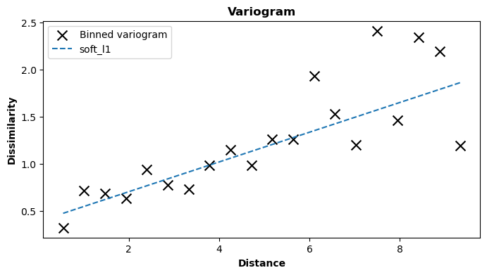
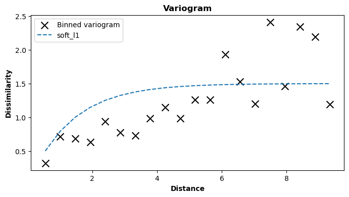

# Creating custom variogram models

## Intro

The GeoKrige package provides several built-in variogram models. For more details, please refer to [this section](built-in_variogram_models.md)
of the documentation.

Every user may have unique requirements regarding the variogram model used for predictions. To accommodate such needs, 
the GeoKrige package supports the definition of custom variogram models by users.

**This is achievable through the utilization of the** `VariogramModel` **class.** Each variogram model comprises two main 
components: the variogram function and the covariance function. These functions must be defined according to specific 
rules and then passed to the `VariogramModel` class. Subsequently, the `VariogramModel` instance with the custom 
functions embedded can be passed to the `model` parameter in the `fit` method.

For a detailed explanation of the `VariogramModel` class, please refer to the comprehensive documentation provided [here](variogram_model_class_description.md).

## Parameters of the most popular variogram models

While any function can indeed be provided to the `VariogramModel` class, including one that consistently returns a 
specific value, **it is important to note that variogram model functions typically involve three or four parameters:**

- **distance** – a distance for which the level of dissimilarity/covariance is returned
- **sill** – a dissimilarity value at which the variogram function starts to flatten out
- **range** – a distance value at which the variogram function starts to flatten out

The above parameters are the most important ones and most popular variogram models contain all of them. However, there 
is one additional parameter that also appears often in the variogram models:

- **nugget** – a value at which the variogram function intercepts the y-axis (dissimilarity)

For more information about variogram model parameters, please see this [tutorial](https://gisgeography.com/semi-variogram-nugget-range-sill/).
**Note that the GeoKrige built-in variogram models do not use the nugget parameter.**

## Nomenclature used in this tutorial

$$
d \, - \, \text{distance}
$$

$$
r \, - \, \text{range}
$$

$$
c \, - \, \text{sill}
$$

$$
n \, - \, \text{nugget}
$$

$$
V(d) \, - \, \text{variogram function}
$$

$$
C(d) \, - \, \text{covariance function}
$$

## Defining a custom variogram function

The variogram function defined below will be embedded to the `VariogramModel` class:

$$
V(d) = c \cdot \left(1 - \exp\left(-\frac{d}{r/3}\right)\right) + n
$$

This function represents a distinct form of an exponential variogram model, differing from the built-in exponential 
variogram model. In this variation, a nugget parameter is introduced, and the calculation of dissimilarity for a given 
distance is slightly different.

Firstly, the function must be declared as a Python function object. **Note that the number of parameters and their names 
are not limited, but the first parameter in functions must represent a distance value.**

```py
import numpy as np
```

```py
def variogram_func(distance, range_param, sill_param, nugget_param):
    return sill_param * (1 - np.exp(-(distance) / (range_param / 3))) + nugget_param
```

## Defining a custom covariance function

Usually, the covariance function in the variogram model is defined as follows:

$$
C(d) = c - V(d)
$$

However, it is important to mention that the GeoKrige package does not perform any validation regarding the logical 
correctness of the functions passed to the `VariogramModel` class. **The only verification conducted by the GeoKrige 
package pertains to the order and naming of parameters in both functions – ensuring that they are ordered and named 
consistently.**

The above equation could be used to directly define a Python function:

```py
def covariance_func(distance, range_param, sill_param, nugget_param):
    return sill_param - variogram_func(distance, range_param, sill_param, nugget_param)
```

However, the equation can be simplified as follows:

$$
C(d) = c - V(d)
$$

$$
C(d) = c - \left( c \cdot \left(1 - \exp\left( -\frac{d}{r/3} \right) \right) + n \right)
$$

$$
C(d) = c \cdot \exp\left(-\frac{d}{r/3}\right) - n
$$

Thus, the definition of a covariance function may look like this:

```py
def covariance_func(distance, range_param, sill_param, nugget_param):
    return sill_param * np.exp(-(distance) / (range_param / 3)) - nugget_param
```

**The most crucial aspect here is that simplifying equations to such a form can significantly enhance calculation 
speed.** It is also worth to note that the in-built covariance functions has been defined exactly in this way.

## Creating a custom variogram model 

```py
from geokrige.tools import VariogramModel

my_variogram_model = VariogramModel()
my_variogram_model.set_variogram_func(variogram_func)
my_variogram_model.set_covariance_func(covariance_func)
```

Now, the `my_variogram_model` instance can be passed to the `variogram_model` parameter in the `fit` method. 

## Using the defined variogram model in practice

```py
from geokrige.methods import SimpleKriging
from geokrige.tutorials import data_df

X = data_df[['lon', 'lat']].to_numpy()
y = data_df['temp'].to_numpy()

kgn = SimpleKriging()
kgn.load(X, y)
kgn.variogram(plot=False)
```

```py
kgn.fit(model=my_variogram_model)
```

<p align="center">
    
</p>

The plot above does not effectively depict the characteristics of the selected variogram model. This situation is 
because of the optimizer which estimated the variogram model parameters so that there is a linear relationship between
variables. Essentially, the Least Squares Error in this scenario is minimized when the line on the plot exhibits linear 
growth.

However, the variogram model parameters can be manually fixed to enhance clarity regarding the characteristics of the 
selected variogram model. This can be achieved by passing the kwarg arguments to the `fit` method, specifying the names 
of parameters along with the values to be fixed for each of them.

```py
kgn.fit(model=my_variogram_model, sill_param=1.5, range_param=4, nugget_param=0)
```

<p align="center">
    
</p>

Below is the covariance matrix that illustrates the covariance between specific points. This matrix is generated using 
the covariance function.

<p align="center">
    
</p>

## General notes

- the GeoKrige package does not perform any validation regarding the logical correctness of the functions passed to the
`VariogramModel` class

- the GeoKrige package verify whether the order and naming of the parameters in both functions are the same

- there are no restrictions on the names & number of parameters. Users are free to use any names and include any 
parameters they prefer. However, **it is crucial to ensure that the first parameter represents a distance value!**