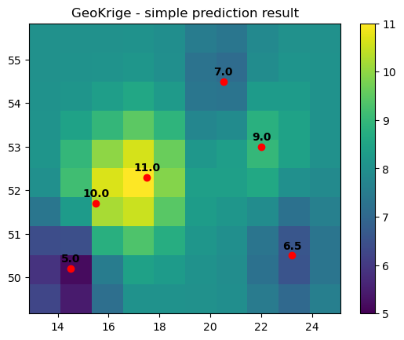

# Welcome to GeoKrige

<p align="center">
    
</p>

For comprehensive documentation, please visit [readthedocs webpage.](https://geokrige.readthedocs.io/en/latest/?).

## What is GeoKrige?

**GeoKrige is a Python package designed for spatial interpolation using Kriging Methods.** While primarily tailored for 
geospatial analysis, it is equally applicable to other spatial analysis tasks.

**GeoKrige** simplifies kriging interpolation, offering an intuitive interface akin to the `SciKit-learn` package.

## Key Features of GeoKrige

- Seamless integration with the [`GeoPandas`](https://geopandas.org/en/stable/#) and [`rasterio`](https://rasterio.readthedocs.io/en/stable/) packages
- **Generation of interpolated mesh grids aligned with the boundaries of provided shapefiles** (ideal for creating 
interpolation maps)
- Evaluation tool for created kriging models
- **Support for multidimensional interpolation** (Multidimensional Kriging)
- Several default variogram models, flexibility for users to define custom models

## GeoKrige in Three Steps

### Prepare data

```py
import numpy as np

m = np.array([14.5, 15.5, 17.5, 20.5, 23.2, 22])
n = np.array([50.2, 51.7, 52.3, 54.5, 50.5, 53])

X = np.column_stack([m, n])
y = np.array([5, 10, 11, 7, 6.5, 9])
```

### Prepare a model

```py
from geokrige.methods import SimpleKriging

kgn = SimpleKriging()
kgn.load(X, y)

kgn.variogram(bins=6, plot=False)
kgn.fit(plot=False)
```

### Predict & plot results

```py
import matplotlib.pyplot as plt

# Perform prediction on a mesh grid
lon = np.linspace(13.5, 24.5, 10)
lat = np.linspace(49.5, 55.5, 10)
meshgrid = np.meshgrid(lon, lat)

X, Y = meshgrid
Z = kgn.predict(meshgrid)

# Plot results
plt.scatter(m, n, color='red', zorder=5)
plt.pcolormesh(X, Y, Z, vmin=5, vmax=11)
plt.colorbar()

for i, value in enumerate(y):
    x_pos = m[i]
    y_pos = n[i]
    plt.text(x_pos, y_pos + 0.15, value, ha='center', fontweight='bold')

plt.title("GeoKrige - simple prediction result")
plt.show()
```

<p align="center">
    
</p>
