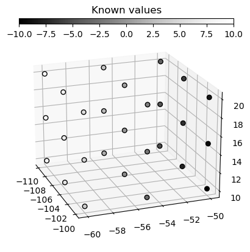

# Multidimensional Kriging

## Intro

The GeoKrige package is not limited to operating solely in two dimensions. **It can operate in an unlimited number of 
dimensions.** The only constraint on the number of dimensions is the computational resources available on the machine 
where it is run – it is important to keep in mind that using more dimensions requires more computational resources.

**Transitioning from operating in two dimensions to working in more dimensions is seamless with the GeoKrige package.** 
The same classes and methods are utilized, with the only change being the input data for specific methods.

## Generate data

```py
import numpy as np

m = np.linspace(-100, -110, 3)
n = np.linspace(-50, -60, 3)
o = np.linspace(10, 20, 3)
M, N, O = np.meshgrid(m, n, o)

X = np.column_stack([M.ravel(), N.ravel(), O.ravel()])
y = np.linspace(-10, 10, 27)
```

**It is important to note that the** `numpy.meshgrid` **function utilized above serves solely for the purpose of 
generating input data for the Kriging Model.** This mesh grid will not be directly used as an input to the `predict` 
method as it usually is. The data created from this mesh grid is visualized below.

**The** `X` **variable is essentially a 2D matrix with three columns, where each column represents one dimension. 
Similarly, the** `y` **variable is a vector of the same length as the** `X` **matrix.** 

This setup functions in much the same way as a standard 2D Kriging Model, except that instead of two columns in the `X` 
matrix, there are three columns representing dimensions.

```py
import matplotlib.pyplot as plt

fig, ax = plt.subplots(subplot_kw={'projection': '3d'})

cax_known = fig.add_axes([0.25, 0.05, 0.55, 0.02], title='Known values')
cbar_known = ax.scatter(X[:, 0], X[:, 1], X[:, 2], c=y, s=30, cmap='Greys_r', edgecolors='k', alpha=1)
fig.colorbar(cbar_known, cax=cax_known, location='bottom')

ax.view_init(20, -20)
plt.show()
```

<p align="center">
    
</p>

## Load the data & fit a variogram function

```py
from geokrige.methods import OrdinaryKriging

kgn = OrdinaryKriging()

kgn.load(X, y)
kgn.variogram(bins=9, plot=False)
kgn.fit(plot=False)
```

## Check briefly the fitting result

```py
kgn.summarize()
```

<p align="center">
    
</p>

## Predict

```py
p = np.linspace(-100, -110, 20)
q = np.linspace(-50, -60, 20)
r = np.linspace(10, 20, 20)
meshgrid = np.meshgrid(p, q, r)
```

For a standard 2D Kriging Model, a mesh grid consisting of two matrices is created. However, in cases where the loaded 
data has more dimensions, the mesh grid used for predictions must accommodate these additional dimensions. To put it 
simply, **the number of matrices inside a list representing a mesh grid must be equal to the number of dimensions on 
which the Kriging Model was trained.**

```py
A, B, C = meshgrid
Z = kgn.predict(meshgrid)
```

Now, there are four matrices available, all with the same shape, which can be used together with the `matplotlib` 
library to visualize the data.

```py
fig, ax = plt.subplots(subplot_kw={'projection': '3d'})

cax_predicted = fig.add_axes([0.25, 0.87, 0.55, 0.02], title='Predicted values')
cbar_predicted = ax.scatter(A, B, C, c=Z, cmap='jet', alpha=1)
fig.colorbar(cbar_predicted, cax=cax_predicted, orientation='horizontal')

cax_known = fig.add_axes([0.25, 0.05, 0.55, 0.02], title='Known values')
cbar_known = ax.scatter(X[:, 0], X[:, 1], X[:, 2], c=y, s=30, cmap='Greys_r', edgecolors='k', alpha=1)
fig.colorbar(cbar_known, cax=cax_known, location='bottom')

ax.view_init(20, -20)

plt.show()
```

<p align="center">
    
</p>