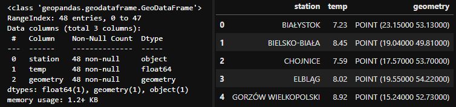
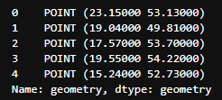
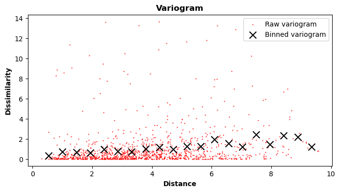
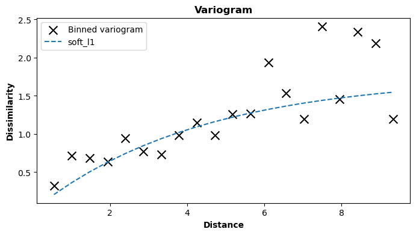
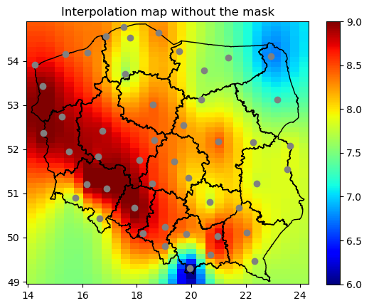
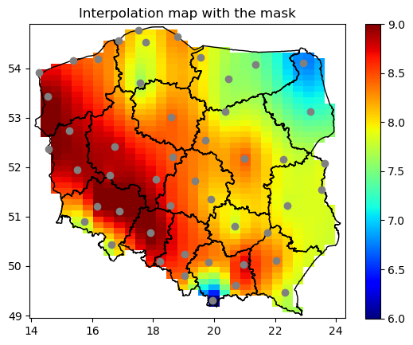
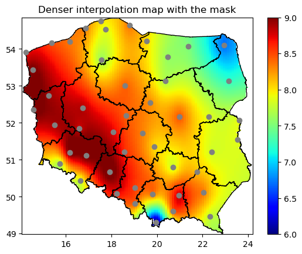
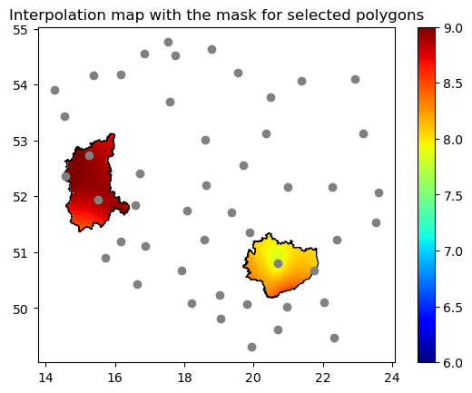

# Using GeoKrige with GeoPandas

## Intro

The GeoKrige package primarily operates on `numpy.ndarray` objects. However, geospatial data is typically handled using 
the GeoPandas package. As a result, **the GeoKrige package's** `load` **method is designed to accept GeoDataFrames.**

Additionally, it includes **a transformer that simplifies the conversion of POLYGONS into a mesh grid.** This 
transformer can also **generate a masking matrix for a mesh grid**, enabling the selection of mesh grid values 
exclusively within POLYGONS boundaries.

## Load tutorial data
```py
from geokrige.tutorials import data_gdf

data_gdf.info()
data_gdf.head(5)
```

<p align="center">
    
</p>

The loaded data represents mean air temperature values for 48 synoptic stations situated in Poland. The dataset spans 
from 1966 to 2020. It is stored as a GeoDataFrame object, with points represented in a geometry column. This geometry 
column is crucial for the GeoKrige package, as it will be utilized to calculate distances between points with known 
values.

```py
data_gdf.geometry.head()
```

<p align="center">
    
</p>

**It is essential to note that the geometry column must exclusively contain points of type POINT** when a GeoDataFrame 
object is passed to the `load` method.

## Initialize model & create a variogram
```py
from geokrige.methods import SimpleKriging

kgn = SimpleKriging()
kgn.load(X, y='temp')
```

In this tutorial, we will use the Simple Kriging Method. For further details regarding the distinctions between 
various Kriging Methods, please refer to this [link](kriging_classes_description.md).

**When passing a GeoDataFrame object to the** `load` **method, the** `y` **parameter must specify the column name where 
the known values are stored.** Spatial distances will be calculated based on the geometry column.

```py
kgn.variogram()
```

<p align="center">
    
</p>

## Fit function to the variogram

```py
kgn.fit(model='exp')
```

<p align="center">
    
</p>

Here, the exponential variogram model is utilized, which effectively fits the data. For additional information regarding 
variogram models, please visit the [Built-in Variogram Models](built-in_variogram_models.md) section or refer to the 
[Variogram - The Foundation of Any Kriging Method paragraph](getting_started.md#variogram-the-foundation-of-any-kriging-method).

## Prediction

**The GeoKrige package offers the capability to transform POLYGONS stored within a GeoDataFrame object into a mesh grid, 
which can then be passed to the** `predict` **method.** This process enables the creation of an interpolation map with ease.
For more information about mesh grids, please see this [paragraph](getting_started.md/#using-the-kriging-model-to-make-predictions).

```py
import geopandas as gpd
shp_file = 'wojewodztwa.shp'
prediction_gdf = gpd.read_file(shp_file).to_crs(crs='EPSG:4326')
```

The shapefile containing Polish voivodeships can be downloaded from the [www.gis-support.pl](https://gis-support.pl/baza-wiedzy-2/dane-do-pobrania/granice-administracyjne/) 
website. You can directly access the file by clicking [here](https://www.gis-support.pl/downloads/2022/wojewodztwa.zip),
or you can download the file from the website by clicking `Województwa` on the linked page. 

After downloading the file, you need to extract its contents into a specific directory on your system. Once extracted, 
you can load the file with a `.shp` extension into a GeoDataFrame object.

### Creating a mesh grid on the basis of a GeoDataFrame object & POLYGONS

```py
from geokrige.tools import TransformerGDF

transformer = TransformerGDF()
transformer.load(prediction_gdf)

meshgrid = transformer.meshgrid(density=0.3)
mask = transformer.mask()
```

**In this manner, a mesh grid is generated and can subsequently be passed to the** `predict` **method.** Setting the 
`density` parameter to 0.3 implies that the resulting mesh grid will be less dense than by default. This difference will 
become evident later in the tutorial.

### Using the created mesh grid to perform predictions 

```py
Z = kgn.predict(meshgrid)
```

The `predict` method will yield another matrix with the same shape as the matrices within the created mesh grid. 
Combining this returned matrix with the matrices in the `meshgrid` variable enables the straightforward creation of an 
interpolation map.

### Visualizing results - with & without the mask

```py
import matplotlib.pyplot as plt
```

```py
fig, ax = plt.subplots()

X.plot(color='grey', zorder=6, ax=ax)  # known points
prediction_gdf.plot(facecolor='none', edgecolor='black', linewidth=1, zorder=5, ax=ax)  # borders

X_lon, Y_lat = meshgrid
cbar = ax.pcolormesh(X_lon, Y_lat, Z, cmap='jet', vmin=6, vmax=9)
fig.colorbar(cbar)

ax.set_title('Interpolation map without the mask')
plt.show()
```

<p align="center">
    
</p>

```py
fig, ax = plt.subplots()

X.plot(color='grey', zorder=6, ax=ax)  # known points
prediction_gdf.plot(facecolor='none', edgecolor='black', linewidth=1, zorder=5, ax=ax)  # borders

X_lon, Y_lat = meshgrid
Z[~mask] = None  # masking pixels out of boundaries
cbar = ax.pcolormesh(X_lon, Y_lat, Z, cmap='jet', vmin=6, vmax=9)
fig.colorbar(cbar)

ax.set_title('Interpolation map with the mask')
plt.show()
```

<p align="center">
    
</p>

In this context, **the previously created mask is used to conceal pixels that fall outside the POLYGONS delineated by the 
shapefile.** 

Utilizing the `mask` method yields a boolean matrix. A `True` value signifies that a given point resides within the 
boundaries of the POLYGONS. 

Consequently, the masking matrix is inverted, as `None` values are assigned to points 
outside the POLYGONS. This signifies to the `matplotlib` package that the respective pixels should not be filled.

### Creating a denser mesh grid
As mentioned earlier, the density of a mesh grid can be adjusted according to user preference. In previous instances, 
the mesh grid created might have been too sparse for some users. **To address this, the** `density` **parameter can be 
utilized** (it is set to 1 by default). 

It is important to note that this parameter must be a positive float. Therefore, if the 
default grid density (1) is insufficient, it can be increased to 2, 3, and so forth. However, it is essential to be 
aware **that denser mesh grids entail longer prediction times.**

```py
meshgrid = transformer.meshgrid(density=1)
mask = transformer.mask()

Z = kgn.predict(meshgrid)
```

```py
fig, ax = plt.subplots()

X.plot(color='grey', zorder=6, ax=ax)  # known points
prediction_gdf.plot(facecolor='none', edgecolor='black', linewidth=1, zorder=5, ax=ax)  # borders

X_lon, Y_lat = meshgrid
Z[~mask] = None
cbar = ax.pcolormesh(X_lon, Y_lat, Z, cmap='jet', vmin=6, vmax=9)
fig.colorbar(cbar)

ax.set_title('Denser interpolation map with the mask')
plt.show()
```

<p align="center">
    
</p>

### Selecting specific POLYGONS

When there are POLYGONS in the GeoDataFrame object with detached boundaries, the `TransformerGDF` will still create one 
common mesh grid that fits extreme points of the boundaries. After that, the `mask` method can be used so that only 
pixels that are within specific 'islands' will be filled.

```py
# selecting only 'lubuskie' & 'świętokrzyskie' voivodeships
prediction_gdf = prediction_gdf.iloc[[1, 12], :]
```

```py
transformer = TransformerGDF()
transformer.load(prediction_gdf)

meshgrid = transformer.meshgrid(density=1)
mask = transformer.mask()

Z = kgn.predict(meshgrid)
```

```py
fig, ax = plt.subplots()

X.plot(color='grey', zorder=6, ax=ax)  # known points
prediction_gdf.plot(facecolor='none', edgecolor='black', linewidth=1, zorder=5, ax=ax)  # borders

X_lon, Y_lat = meshgrid
Z[~mask] = None
cbar = ax.pcolormesh(X_lon, Y_lat, Z, cmap='jet', vmin=6, vmax=9)
fig.colorbar(cbar)

ax.set_title('Interpolation map with the mask for selected polygons')
plt.show()
```

<p align="center">
    
</p>